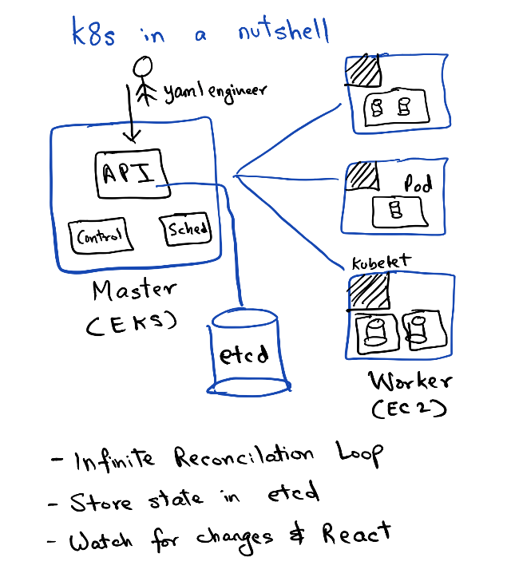

# Learning the basics

Kubernetes controllers are basically on an infinite reconciliation loop. Controllers in Kubernetes are control loops that watch the state of your cluster and if the real-world state drifts apart from the desired state, it "reacts" to those changes. Any controller in K8s tracks a particular resource spec, for example, the Deployment controller would track the Pods.

The resource spec of an object in Kubernetes describes the desired state. The desired state has some metadata about the object, the `apiVersion` to use (specifying K8s API version), the name of the object, etc. Once you create this object, the controller manipulates the same `spec` to show information about the real world state as well under the field `status`. The controller would continuously monitor the real and desired state and trigger an event in the API server if it notices any drift.

Before we begin writing down the manifest files, we must understand why knowing about this behavior is important to us. Every single object you create in K8s is created with a manifest file. This manifest file declaratively sets the config values of the objects you create.

Now, the K8s API is quite verbose and not very straightforward for developers trying it out the first time. Also for any seasoned DevOps engineer, writing these manifest files becomes a monotonous and repetitive task. This served as an inspiration to build `kubekutr` which helps developers scaffold these manifests files from scratch. `kubekutr` takes minimum supported configuration values to create a **base** deployment. For complex configuration use cases, we use `kustomize` which modify our base manifests to create variants.

Let's proceed to writing our first `kubekutr` configuration file [here](./03_01_kubekutr_config.md).
